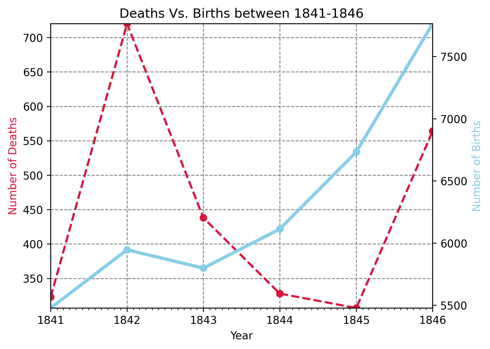
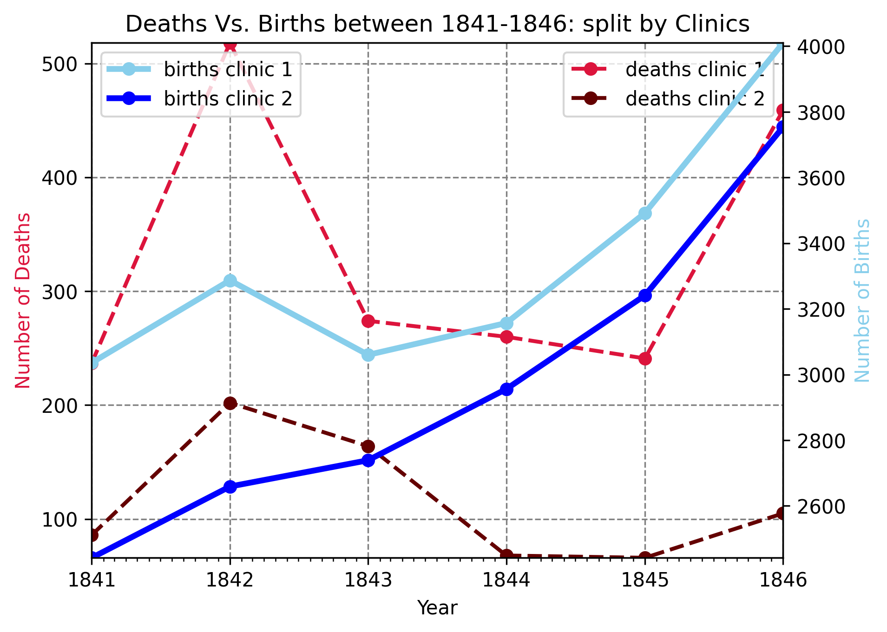
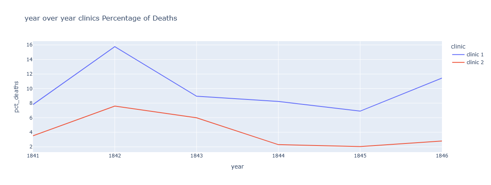
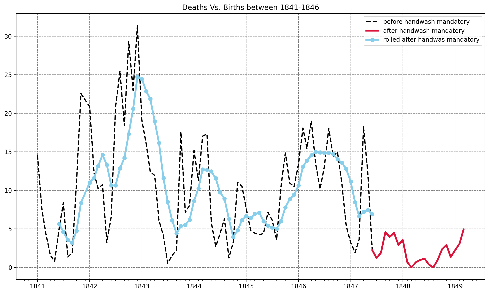
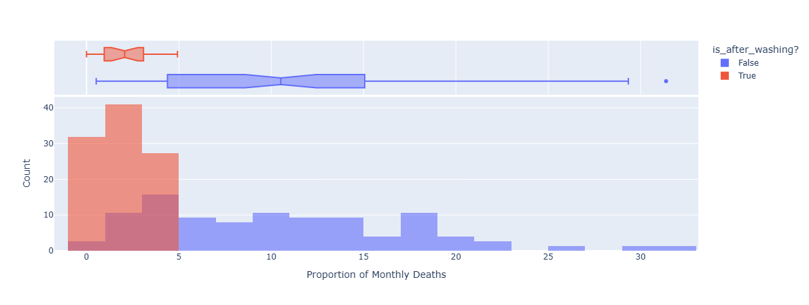
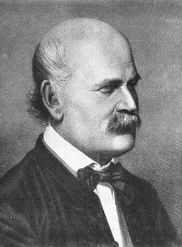

# Dr. Semmelweis Handwashing Discovery

| [Overview](https://github.com/erfaw/dr-semmelweis-handwashing-discovery?tab=readme-ov-file#-overview) 
| [The Data Source](https://github.com/erfaw/dr-semmelweis-handwashing-discovery?tab=readme-ov-file#the-data-source) 
| [Outputted Diagrams](https://github.com/erfaw/dr-semmelweis-handwashing-discovery?tab=readme-ov-file#%EF%B8%8F-outputted-diagrams) 
| [Final Fate of Dr. Semmelweis](https://github.com/erfaw/dr-semmelweis-handwashing-discovery?tab=readme-ov-file#the-final-fate-of-dr-semmelweis) 
| [What I Learned](https://github.com/erfaw/dr-semmelweis-handwashing-discovery?tab=readme-ov-file#-what-i-learned) 
|

---
 
 
 
 
 
 
 
 
 

## 📝 Overview 

### Introduction

Dr Ignaz Semmelweis was a Hungarian physician born in 1818 who worked in the Vienna General Hospital. In the past people thought of illness as caused by "bad air" or evil spirits. But in the 1800s Doctors started looking more at anatomy, doing autopsies and started making arguments based on data. Dr Semmelweis suspected that something was going wrong with the procedures at Vienna General Hospital. Semmelweis wanted to figure out why so many women in maternity wards were dying from childbed fever (i.e., [puerperal fever](https://en.wikipedia.org/wiki/Postpartum_infections)).

Today you will become Dr Semmelweis. This is your office 👆. You will step into Dr Semmelweis' shoes and analyse the same data collected from 1841 to 1849.

### The Data Source

Dr Semmelweis published his research in 1861. I found the scanned pages of the [full text with the original tables in German](http://www.deutschestextarchiv.de/book/show/semmelweis_kindbettfieber_1861), but an excellent [English translation can be found here](http://graphics8.nytimes.com/images/blogs/freakonomics/pdf/the%20etiology,%20concept%20and%20prophylaxis%20of%20childbed%20fever.pdf).

---

## 🖼️ Outputted Diagrams 

### Deaths Vs. Births between 1841-1846

### Deaths Vs. Births between 1841-1846 Split By Clinics

### Before and After of Handwashing Order 

### Count Proportion of Monthly Deaths 

---

## The Final Fate of Dr. Semmelweis

<table>
    <td>
        
 
            Despite the remarkable success of his handwashing policy, Ignaz Semmelweis faced strong opposition from many influential members of the medical community. His ideas challenged established beliefs, and as a result, he lost his position at Vienna General Hospital. Over time, his recommendations were largely ignored, and mortality rates began to rise again.
            In his later years, Semmelweis became increasingly frustrated and isolated. Historians still debate the cause of his declining mental health, suggesting possibilities such as severe stress, dementia, or other illnesses. In 1865, at the age of 47, he was committed to a mental asylum. There, he reportedly suffered physical abuse and developed a severe wound that became infected.
            Tragically, Semmelweis died from sepsis (blood poisoning) only weeks later—the very type of infection he had dedicated his career to preventing. His work was not fully recognized until decades after his death, when Louis Pasteur's germ theory and subsequent advances in microbiology provided the scientific foundation that validated his discoveries. Today, Semmelweis is remembered as a pioneer of antiseptic medicine whose contributions helped save countless lives. <b>RIP!</b>
        

    </td>
    <td width=15%>
        
    </td>
</table>

---

## 💡 What I Learned 

* Performing `exploratory data analysis` (EDA) using `Pandas`.
* Cleaning, organizing, and preparing `real-world datasets for analysis`.
* Creating static and interactive visualizations with `Matplotlib` and `Plotly`.
* Understanding the `importance of data visualization` in communicating insights effectively.
* Learning how `presentation` and `storytelling` can make analytical findings `more impactful` and `easier to understand`.
* Using statistical data to support or `challenge hypotheses with evidence rather than intuition.`
* Identifying trends and patterns through historical data analysis.
* Comparing datasets from multiple sources to uncover meaningful differences and relationships.
* Gaining a deeper appreciation for the `role of data in scientific discoveries and medical research`.
* Understanding how data-driven evidence contributed to validating Dr. Semmelweis's handwashing recommendations.
* Developing the ability to transform raw data into clear conclusions and actionable insights.
* Practicing the process of communicating technical findings to a broader audience.
